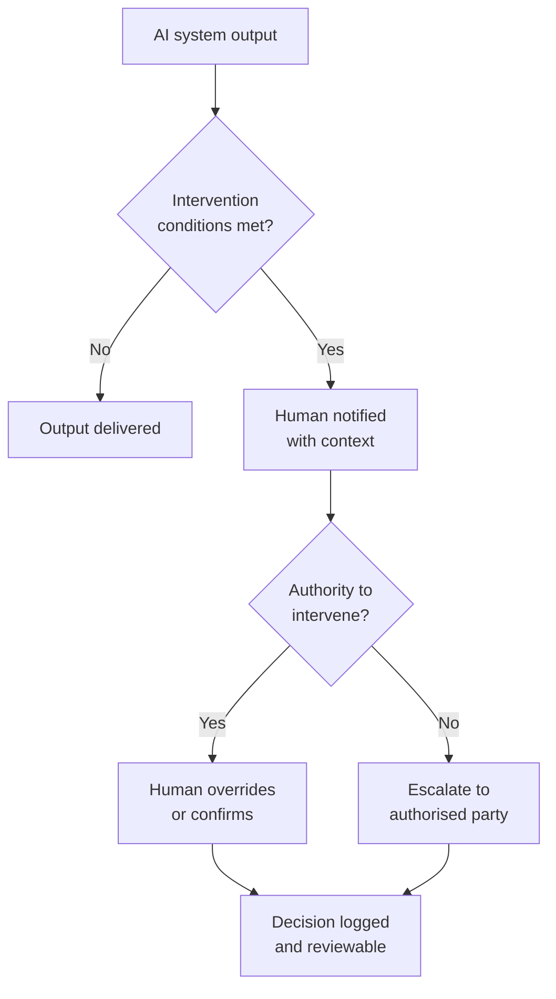

# AI Accountability Design Patterns

A practical pattern library for designing human accountability into AI-enabled systems — covering escalation logic, ownership models, and intervention paths.

---

## Why this exists

AI systems often fail operationally not only because of model behaviour, but because:

- escalation logic is vague or missing
- ownership is fragmented across teams
- humans are nominally "in the loop" but lack real authority
- override paths are under-specified or untested

---

## Core design principle

> Human oversight is only meaningful when: intervention conditions are explicit, authority is real, context is sufficient, and decisions are logged and reviewable.

---

## Patterns included

| Pattern | What it addresses |
|---------|-----------------|
| `patterns/human-override.md` | When and how humans can override AI decisions |
| `patterns/escalation-thresholds.md` | Defining triggers for human escalation |
| `patterns/ownership-models.md` | Assigning clear operational ownership |
| `patterns/decision-context.md` | Ensuring humans have sufficient context to act |
| `patterns/incident-accountability.md` | Post-incident ownership and review |

---

## Worked examples

| Example | Industry context |
|---------|----------------|
| `examples/customer-support-agent.md` | AI-assisted customer service with override path |
| `examples/ivi-assistant.md` | In-vehicle AI assistant with safety escalation |

---

## Templates

- `templates/accountability-review-checklist.md` — review checklist for new AI deployments

---

## Who this is for

- AI product managers designing human-in-the-loop systems
- Platform and systems engineers implementing escalation logic
- Governance and risk leaders in regulated industries
- Operations and quality teams accountable for AI outcomes

---

## Related repositories

This repository is part of a connected toolkit for responsible AI operations:

| Repository | Purpose |
|-----------|---------|
| [Enterprise AI Governance Playbook](https://github.com/simaba/enterprise-ai-governance-playbook) | End-to-end AI operating model from intake to improvement |
| [AI Release Governance Framework](https://github.com/simaba/ai-release-governance-framework) | Risk-based release gates for AI systems |
| [AI Release Readiness Checklist](https://github.com/simaba/ai-release-readiness-checklist) | Risk-tiered pre-release checklists with CLI tool |
| [AI Accountability Design Patterns](https://github.com/simaba/ai-accountability-design-patterns) | Patterns for human oversight and escalation |
| [Multi-Agent Governance Framework](https://github.com/simaba/multi-agent-governance-framework) | Roles, authority, and escalation for agent systems |
| [Multi-Agent Orchestration Patterns](https://github.com/simaba/multi-agent-orchestration-patterns) | Sequential, parallel, and feedback-loop patterns |
| [AI Agent Evaluation Framework](https://github.com/simaba/ai-agent-evaluation-framework) | System-level evaluation across 5 dimensions |
| [Agent System Simulator](https://github.com/simaba/agent-system-simulator) | Runnable multi-agent simulator with governance controls |
| [LLM-powered Lean Six Sigma](https://github.com/simaba/LLM-powered-Lean-Six-Sigma) | AI copilot for structured process improvement |

---

*Shared in a personal capacity. Open to collaborations and feedback — connect on [LinkedIn](https://linkedin.com/in/simaba) or [Medium](https://medium.com/@bagheri.sima).*
